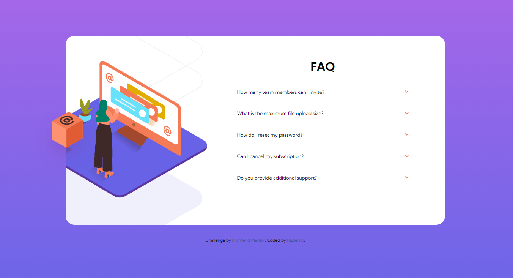

# Frontend Mentor - FAQ accordion card solution

This is a solution to the [FAQ accordion card challenge on Frontend Mentor](https://www.frontendmentor.io/challenges/faq-accordion-card-XlyjD0Oam). Frontend Mentor challenges help you improve your coding skills by building realistic projects. 

## Table of contents

- [Overview](#overview)
  - [The challenge](#the-challenge)
  - [Screenshot](#screenshot)
  - [Links](#links)
- [My process](#my-process)
  - [Built with](#built-with)
  - [What I learned](#what-i-learned)
  - [Continued development](#continued-development)
  - [Useful resources](#useful-resources)
- [Author](#author)

**Note: Delete this note and update the table of contents based on what sections you keep.**

## Overview

### The challenge

Users should be able to:

- View the optimal layout for the component depending on their device's screen size
- See hover states for all interactive elements on the page
- Hide/Show the answer to a question when the question is clicked

### Screenshot



### Links

- Solution URL: [Add solution URL here](https://github.com/RazielTX/faqaccordion)
- Live Site URL: [Add live site URL here](https://your-live-site-url.com)

## My process

### Built with

- Semantic HTML5 markup
  - Details tag
- CSS only (no JS)
  - Animations and Keyframes
- Flexbox
- Mobile-first workflow

### What I learned

For the very first time I used the details and summary tag, which is a good resource, although for the styling I needed to do a research because what I tried first did not work.

In the following snnipet you woill find how I managed to style the details tag:

```css
.faq-item[open] .faq-sum ~ *{
    animation: open .5s ease-in-out;
}

@keyframes open {
    0% {opacity: 0; margin-left: -20px}
    100% {opacity: 1; margin-left: 0px}
}

.faq-arrow {
    transform: rotate(0);
    transition: transform .3s ease-out;
}

.faq-item[open] .faq-arrow{
    transform: rotate(180deg);
    transition: transform .5s ease-out;
}
```

Another thing that I learned is that position absolute is complex if we use `%` in order to position the elements. For example in this accordion when I opened the accordion elements, the parent grew and the images moved with it. The issue was that different images with different sizes and scales used different `%` values, hence once the parent grew, every image moved relatively different. Therefore, finally I decided to use `px` in the Y axis instead of `%`.

```css
.img-desktop-bg {
  transform: scale(2.2);
  left: -80%;
}

.img-desktop-main {
  transform: scale(1.05);
  top: 74px;
  left: -20%;
}

.img-desktop-box {
  transform: scale(0.9);
  top: 189px;
  left: -20%;
}
```


### Continued development

I am going to create this project again, but this time using Bootstrap/JS. I want to try different technologies/frameworks just to practice.

### Useful resources

- [Overflow reminder](https://developer.mozilla.org/en-US/docs/Learn/CSS/Building_blocks/Overflowing_content) - This helped me to recap the overflow behavior
- [Some of the issues with the details tag](https://css-tricks.com/two-issues-styling-the-details-element-and-how-to-solve-them/) - This resource helped me to understand a little bit better how to style the details tag

## Author

- Website - [Fabian Bejarano](https://github.com/RazielTX)
- Frontend Mentor - [@RazielTX](https://www.frontendmentor.io/profile/RazielTX)
- Twitter - [@ThePianistFB](https://www.twitter.com/ThePianistFB)